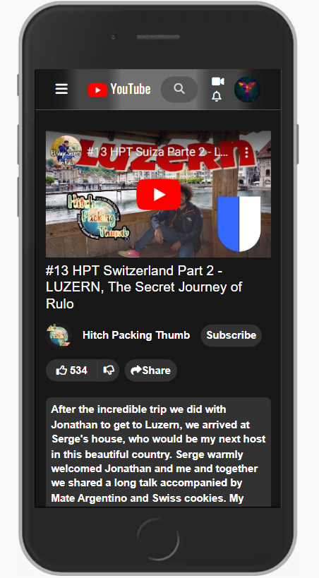
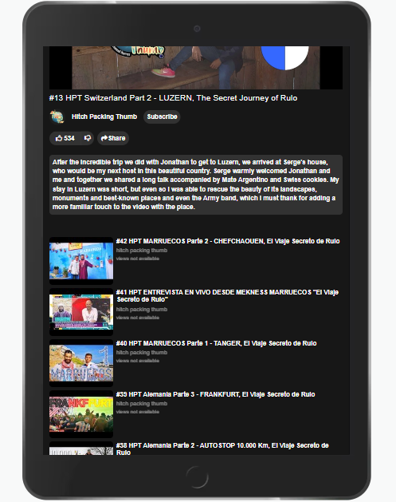

## Project Media TOP

#### YouTube's style 'clone' as of April 2023 (dark-mode)

---

#### **\*Previews at the end of this file.**

#### or have a look at <https://iturres.github.io/project_media_TOP/>

---

## Built With

- HTML - HTML5
- CSS - CSS3
- JavaScript
- Bootstrap
- Youtube API (Removed - due to quota limit)

#### 

---

#### Note: Buttons such as => menu - search - video - notifications - account - subscribe - like - dislike - share = are not functional.

---

##### Mobile preview:

  

---

##### Tablet preview:

  

---

##### Desktop preview:

  

---
